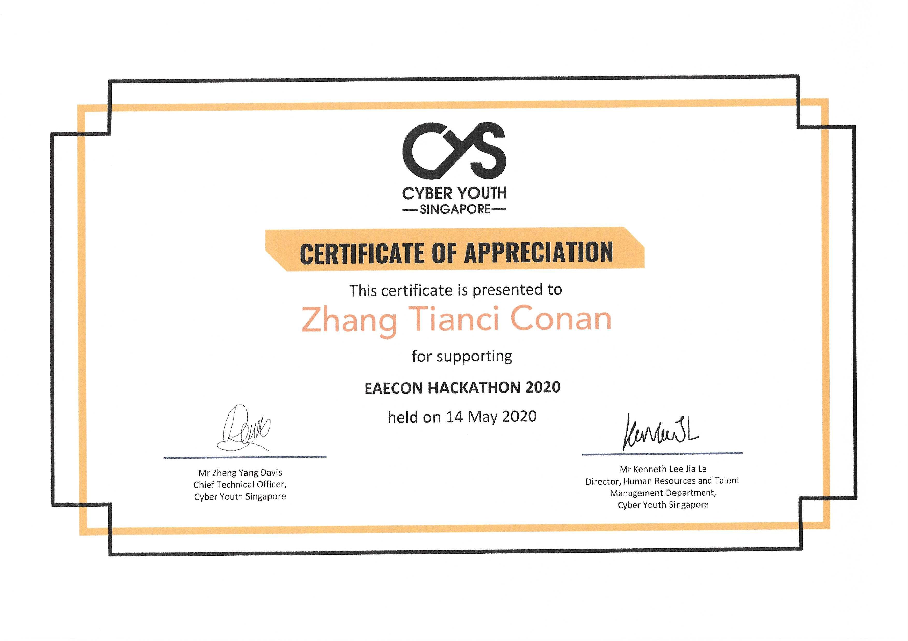

---

## What Is It?

EAEcon served as an avenue for secondary school students to learn and hone the skills needed to take part in the Early Admissions Exercise, in order to secure a spot in a diploma of their choice before O levels. CYS hosted a simple web development lesson for the students to help craft and onboard their portfolios as a website.

CYS also engaged with the youths by inviting past successful EAE applicants to share more about their experiences as well as the tips and tricks that they had used to get through the exercise.

---

## What took place?

I was one of the co-organisers and we inspired dozens of youths to pursue their interest in Cybersecurity.

## Awarding Institution

Cyber Youth Singapore (CYS)

## Which award did I obtain?

Certificate of appreciation

## View my credentials

## Reference

[EARLY ADMISSIONS EXERCISE CONVENTION 2020](https://www.cyberyouth.sg/events/early-admissions-exercise-convention-2020)

