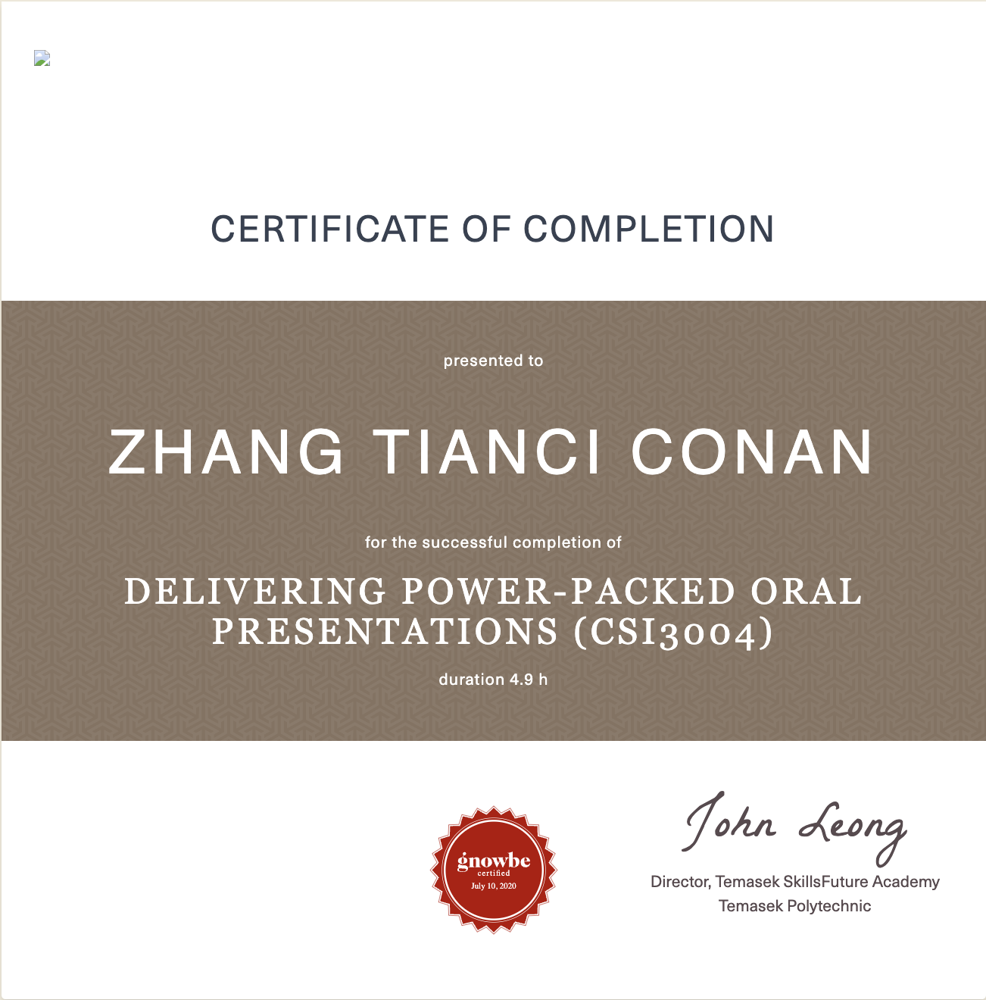


{}
Digital Verification - Provided by Gnowbe.
{}

---

## What Is It?

This course will equip participants to deliver oral presentations in their workplaces and in business settings with poise and professionalism.

Participants who are interested to acquire the skills in planning and preparing effective oral presentations for workplace settings.

---

## What took place?

At the end of this course, you will be able to:

- Use verbal and non-verbal language to present ideas
- Use appropriate tone
- Clarify points raised using visuals
- Identify the purposes of questions posed by the audience in a presentation
- Apply appropriate techniques to respond to questions tactfully and professionally

## Awarding Institution

Temasek SkillsFuture Academy, Temasek Polytechnic

## Which award did I get?

Certificate of completion

## View my credentials


{}
Verify via 
{}


## Reference

[DELIVERING POWER-PACKED ORAL PRESENTATIONS](https://www.tp.edu.sg/schools-and-courses/adult-learners/all-courses/online-learning/micro-learning-courses/suite-courses/delivering-power-packed-oral-presentations.html)

