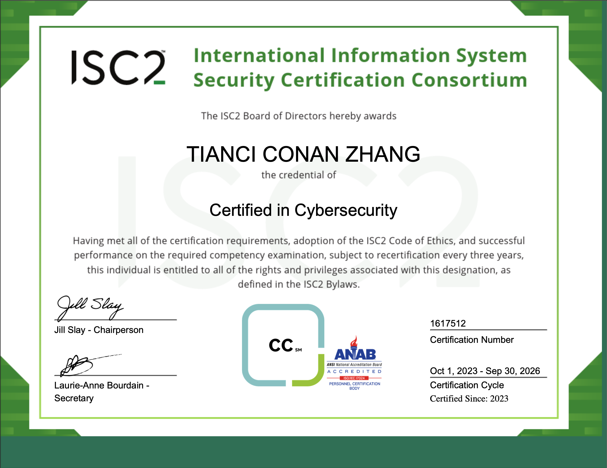


{}
Digital Verification - Provided by Credly.
{}

---
---
## What Is It?

An (ISC)² Cerified in Cybersecurity (CC) certificate demonstrate that an individual has the foundational knowledge of industry terminology, network security, security operations and policies and procedures.

---

## Note from ISC2

TIANCI CONAN ZHANG, the credential of Certified in Cybersecurity, having met all of the certification requirements, adoption of the ISC2 Code of Ethics, and successful performance on the required competency examination, subject to recertification every three years, this individual is entitled to all of the rights and privileges associated with this designation, as defined in the ISC2 Bylaws.

## Awarding Institution

(ISC)2

## Which award did I get?

Certified in Cybersecurity professional certificate and verified badge

## View my credentials (Badge)

{}
Verify via 
{}


## View my credentials (Cerificate)

## How did I get the award?


{}
Content updating **come back later!**
{}


## Reflection / takeaway / thoughts


{}
Content updating **come back later!**
{}


## Reference

NIL

