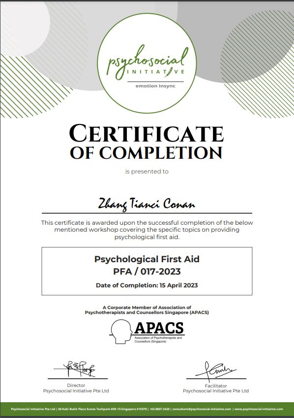

---

## What Is It?

Psychological First Aid (PFA) is a crisis response intervention technique that facilitates recovery and reduces trauma-related stress after a crisis hits.

---

## Awarding Institution

Psychosocial Initiative, Singapore

## Which award did I get?

Certificate of completion

## View my credentials

## How did I get the award?

Over the weekend, I have had the opportunity in completing and obtaining this PFA certification jointly conducted by the Psychosocial Initiative, Singapore and the Ministry of Social and Family Development, Singapore (MSF) for its volunteers in the ComLink Befriender initiative.

## Reflection / takeaway / thoughts

I am sure the knowledge acquired from this #training will be valuable and helpful in supporting my volunteering responsibility as a ComLink befriender.

## Reference

NIL

