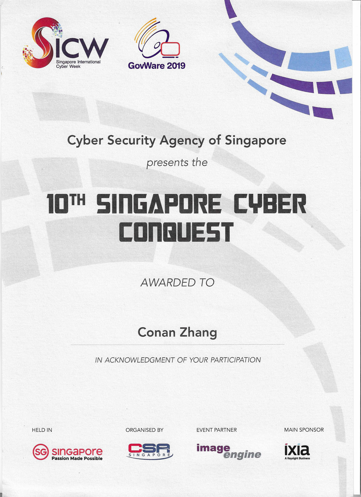

---

## What Is It?

The 10th edition of the Singapore Cyber Conquest (SCC), a Capture-the-Flag competition for students from Institutes of Higher Learning (IHL), took place during the Singapore International Cyber Week 2019. A total of 37 teams from both Singapore and ASEAN Member States, competed in a simulated real-world cyber range designed to test cybersecurity skills and knowledge. 

This is the second year IHLs from ASEAN Member States have participated in the competition, enabling students within the region to interact and learn from one another.

---

## What took place?

Each team, comprising two students, took on Red and Blue team-type challenges. The red team member had to discover and penetrate network services while the blue team member monitored network traffic and analysed packet logs.

Students were tested on cybersecurity domains such as penetration testing, security operations and cryptography as they raced against time to accumulate as many points as possible by completing tasks and obtaining answers known as “flags”.

## Awarding Institution

Cyber Security Agency of Singapore (CSA)

## Which award did I obtain?

Certificate of participation

## View my credentials

## CTF Team

pepehands

## Reference

[10th Singapore Cyber Conquest Champions Announced](https://www.csa.gov.sg/News-Events/News-Articles/2019/10th-Singapore-Cyber-Conquest-Champions-Announced)

