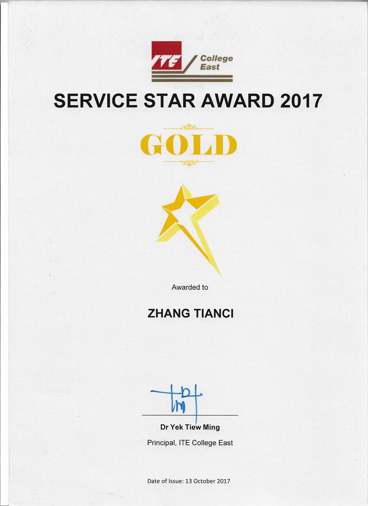

---

## What Is It?

The Service Star Award is one platform through which ITE College recognises students who have displayed excellent service mindset towards other individuals or institutions and/or are involved in community service or have contributed to the college in notable ways.

---

## What took place?

The award was given during class.

## Awarding Institution

Institute of Technical Education, College East

## Which award did I get?

Gold

## View my credentials

## How did I get the award?


{}
Content updating **come back later!**
{}


## Reflection / takeaway / thoughts


{}
Content updating **come back later!**
{}


## Reference

NIL

