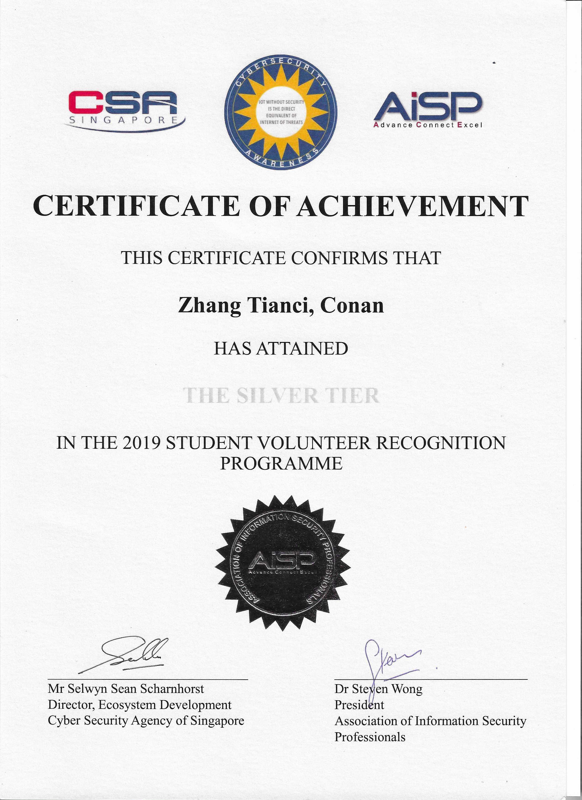

---

## What Is It?

The SVRP aims to encourage volunteerism amongst students while developing their interest in cybersecurity. It is organised by the Association of Information Security Professionals and backed by the Cyber Security Agency of Singapore (CSA), with support from the National Youth Council and private sector players; Singtel, Trend Micro, Booz Allen Hamilton and Ensign InfoSecurity.

---

## What took place?

The inaugural Student Volunteer & Recognition Programme (SVRP) Award Ceremony was held on 6 November 2019 to recognise student volunteers for their contributions to the cybersecurity community. 

The ceremony was graced by Senior Minister of State for Communications and Information Sim Ann. SMS Sim Ann presented four students with the SVRP Gold Award. There were also 33 Silver and 47 Bronze Award recipients, presented by Mr Selwyn Scharnhorst, Director of Ecosystem Development at the Cyber Security Agency of Singapore (CSA) and Mr Freddy Tan, Association of Information Security (AiSP) SRVP Exco Lead.

## Which award did I get?

Silver

## Reference

["Inaugural Student Volunteer & Recognition Programme Award Ceremony" article by Cyber Security Agency of Singapore](https://www.csa.gov.sg/News-Events/News-Articles/2019/Inaugural-Student-Volunteer-and-Recognition-Programme-Award-Ceremony)

["Student Volunteer Recognition Programme by AISP, Singapore." instagram post by @conanzhang.tech](https://www.instagram.com/p/B4h_P4Tnj6g/)

["SVRP AWARDS CEREMONY 2019" article by Association of Information Security Professionals, Singapore](https://www.aisp.sg/svrp_2019.html)

## View my credentials

