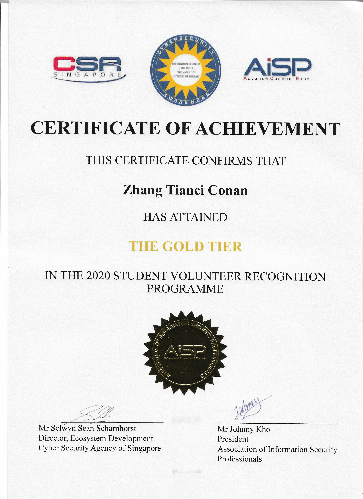

---

## What Is It?

Developed by Association of Information Security Professionals (AiSP) and Cyber Security Agency of Singapore (CSA), the SVRP aims to encourage volunteerism amongst students while honing their interest and skills in cybersecurity. SVRP, an initiative under CSA’s SG Cyber Youth Programme, has received strong participation and support from local Institutes of Higher Learning (IHLs) as well as AiSP’s industry partners.

---

## What took place?

The second edition of the Student Volunteer & Recognition Programme (SVRP) Awards Ceremony was held on 24 March 2021 to recognise student volunteers for their contributions to the cybersecurity community. In 2020, close to 100 student volunteers in the SVRP contributed more than 9,000 hours of volunteering to the cybersecurity community.

Dr. Janil Puthucheary, Senior Minister of State for Communications and Information and Health, graced the event. A total of 64 Gold, Silver and Bronze awards were given to the student volunteers this year. Award recipients contributed at least 120 hours of volunteer work, with six Gold Award recipients contributing at least 150 hours each.

## Awarding Institution

Association of Information Security Professionals (AISP), Singapore

## Which award did I get?

Gold

## View my credentials

## How did I get the award?


{}
Content updating **come back later!**
{}


## My personal reflection / takeaway / thoughts


{}
Content updating **come back later!**
{}


## Reference

["Student Volunteer & Recognition Programme Awards Ceremony 2020" article by Cyber Security Agency of Singapore](https://www.csa.gov.sg/News-Events/News-Articles/2021/svrp-awards-ceremony-2020)

["Student Volunteer Recognition Programme 2020 organised by @aisp.sg, supported by @csasingapore and ensign_infosecurity." instagram post by @conanzhang.tech](https://www.instagram.com/p/B4h_P4Tnj6g/)

["SVRP AWARDS CEREMONY 2020" article by Association of Information Security Professionals, Singapore](https://www.aisp.sg/svrp_2020.html)

